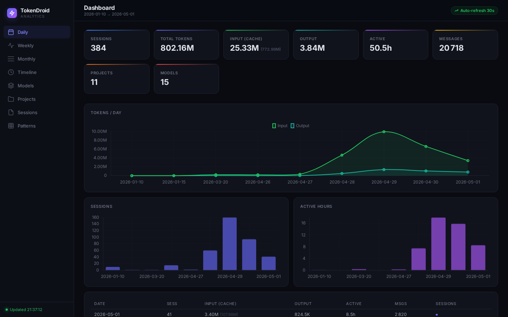

# TokenDroid

Analytics dashboard for Factory Droid usage data. Parses session files from
`~/.factory/sessions/`, indexes them into a local SQLite cache, and provides
multiple interfaces to explore token consumption, model usage, and project
activity.



---

## Features

| Interface | Description |
|-----------|-------------|
| **CLI** | Rich-powered terminal commands for overviews, daily/weekly/monthly breakdowns, and top session reports. Supports `--json` output for scripting. |
| **TUI** | Interactive Textual dashboard with tabs, sparklines, and auto-refresh every 30 seconds. |
| **Web** | Full-featured browser dashboard with Chart.js graphs, sortable tables, hourly/weekday heatmaps, and a single-page JSON API. |

---

## Installation

```bash
uv sync
```

---

## Usage

### Sync

```bash
tokendroid sync          # Incremental sync from ~/.factory
tokendroid sync --full   # Force full re-sync
```

### CLI

```bash
tokendroid stat overview                              # Global KPIs, models, projects
tokendroid stat overview --project myproject --json   # Filtered, JSON output
tokendroid stat daily --from 2025-01-01 --to 2025-01-31
tokendroid stat weekly
tokendroid stat monthly
tokendroid stat top -n 20                             # Top 20 sessions by tokens
```

### Interactive TUI

```bash
tokendroid tui
```

Key bindings: `r` refresh, `s` force sync, `q` quit.

### Web Dashboard

```bash
tokendroid web                # Launch on http://127.0.0.1:8080
tokendroid web --port 9000    # Custom port
tokendroid web --no-open      # Don't open the browser
```

---

## API

| Endpoint | Method | Description |
|---|---|---|
| `/` | `GET` | Web dashboard (HTML) |
| `/api/dashboard` | `GET` | Full dashboard payload (JSON) |
| `/api/stats` | `GET` | Filtered stats with query params |
| `/api/sync` | `POST` | Force full re-sync |

Query parameters for `/api/stats`: `project`, `model`, `date_from`, `date_to`.

---

## Architecture

```
src/tokendroid/
  cli.py               Click CLI entry point
  models.py            Dataclasses for sessions, stats, summaries
  parser.py            Reads ~/.factory sessions, settings, history
  db.py                SQLite cache with incremental sync
  display/
    utils.py           Shared formatters, colors, sparklines
    rich_cmd.py        Rich CLI display commands
    tui.py             Textual TUI dashboard
  web/
    app.py             FastAPI web server + API endpoints
    templates/
      dashboard.html   Single-page Chart.js dashboard
```

**Data flow:**

`~/.factory/sessions/` --> `parser.py` --> `db.py` (SQLite) --> `display/` | `web/`

---

## Development

```bash
ruff check src/ tests/    # Lint
pytest tests/ -v           # Run tests (49 tests)
uv run tokendroid stat overview   # Run without install
```

---

## License

MIT
